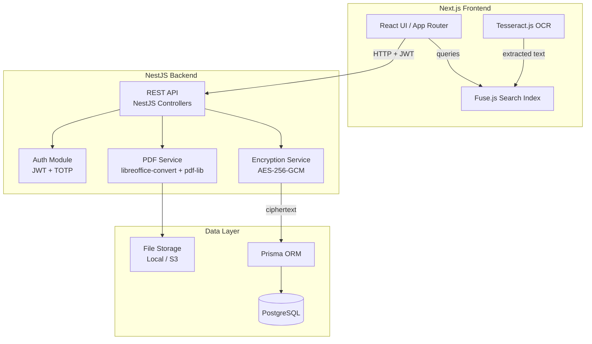
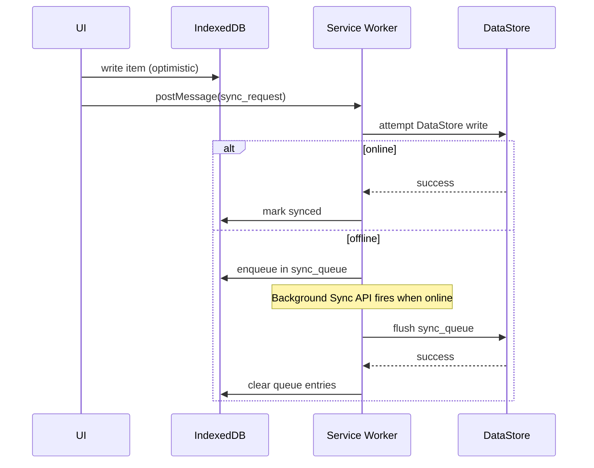
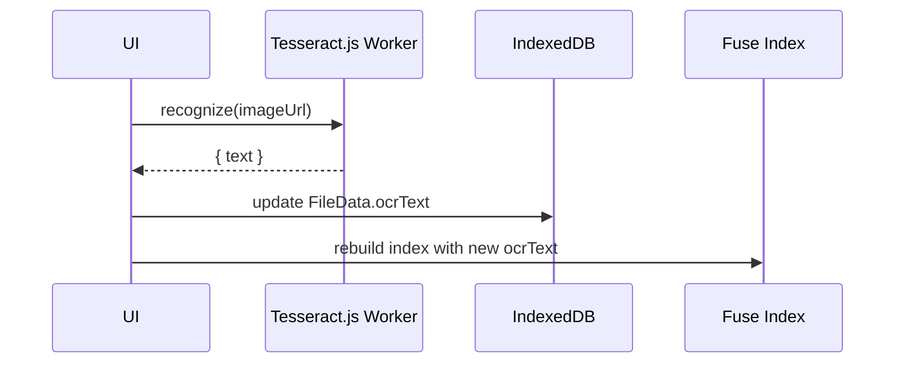

# Design Document: Personal Vault

## Overview

The Personal Vault evolves the existing link manager into a unified encrypted digital vault. Users can store links, notes, passwords, images, documents, and arbitrary files in one place — accessible from any device, protected by server-side AES-256 encryption, and backed by a PostgreSQL database.

The key competitive differentiators baked into this design:

- **Zero-knowledge passwords** — AES-256-GCM encryption is applied server-side before persistence; the database never stores plaintext password values or private note content.
- **Unified search** — Fuse.js full-text index across all item types, plus Tesseract.js OCR for images.
- **Three-layer auth** — PBKDF2 key derivation, TOTP via `otpauth`, 5-attempt lockout, plus silent email verification per section.
- **Document conversion** — All uploaded documents and images are converted to PDF using `libreoffice-convert` and `pdf-lib` for unified preview.

## Tech Stack

| Layer | Technology |
|---|---|
| Frontend | Next.js 15 (App Router), React 19, TypeScript |
| Backend | NestJS, TypeScript |
| Database | PostgreSQL |
| ORM | Prisma |
| Validation | Zod (shared types between frontend and backend) |
| Encryption | AES-256-GCM (Node.js `crypto` module, server-side) |
| PDF conversion | `libreoffice-convert` + `pdf-lib` |
| Auth | JWT (NestJS Guards) + TOTP (`otpauth`) |
| Styling | Tailwind CSS |

---

## Architecture

### High-Level Data Flow



### Route Structure (Next.js App Router)

```
app/
  (auth)/
    lock/                  → lock screen
  (vault)/
    vault/                 → main vault view
    vault/[itemId]/        → item detail / editor
    vault/new/[type]/      → create item
    collections/           → collection manager
    search/                → full-text search results
    settings/              → settings panel
    audit/                 → audit log viewer
```

### NestJS Backend Module Structure

```
src/
  auth/                    → JWT strategy, TOTP, session guards
  vault-items/             → CRUD for all item types
  collections/             → collection management
  tags/                    → tag management
  files/                   → upload, PDF conversion, download
  audit/                   → audit log
  settings/                → user settings
  encryption/              → AES-256-GCM service
  email/                   → verification email dispatch
  prisma/                  → PrismaService
```

### State Management (Frontend)

- **Zustand** — `useVaultStore` holds session state (JWT token, lock status, current collection, view preference).
- **TanStack Query** — server-state for API reads/writes with stale-while-revalidate.

---

## Components and Interfaces

### Component Tree

```
<VaultApp>
  <LockScreen />                    ← shown when !session.unlocked
  <VaultLayout>
    <Sidebar>
      <CollectionList />
      <TagCloud />
      <QuickActions />
    </Sidebar>
    <MainPanel>
      <SearchBar />                 ← Fuse.js powered
      <ViewToggle />                ← grid | list
      <VirtualItemGrid />           ← @tanstack/react-virtual
      <VirtualItemList />
    </MainPanel>
    <DetailPanel>
      <LinkViewer />
      <NoteEditor />                ← TipTap
      <PasswordViewer />
      <FileViewer />
      <ImageViewer />
    </DetailPanel>
  </VaultLayout>
  <OfflineBanner />
  <AuditLogDrawer />
  <SettingsSheet />
  <BackupDialog />
</VaultApp>
```

### Key Component Interfaces

```typescript
// Item grid/list — virtual scrolling
interface VirtualItemGridProps {
  items: VaultItem[];
  onSelect: (id: string) => void;
  onDelete: (id: string) => void;
}

// Note editor
interface NoteEditorProps {
  item: NoteItem;
  onSave: (content: TipTapJSON) => void;
  isPrivate: boolean;
}

// Password viewer
interface PasswordViewerProps {
  item: PasswordItem;
  onCopy: () => void;
  onReveal: () => void;
  revealDuration?: number; // default 30s
}

// File upload
interface FileUploadZoneProps {
  onUpload: (file: File) => void;
  maxSizeBytes?: number; // default 100MB
  accept?: string;
}
```

---

## Data Models

### Prisma Schema

```prisma
// prisma/schema.prisma

generator client {
  provider = "prisma-client-js"
}

datasource db {
  provider = "postgresql"
  url      = env("DATABASE_URL")
}

model VaultItem {
  id           String   @id @default(uuid())
  type         ItemType
  title        String
  collectionId String   @default("uncategorized")
  tags         Tag[]    @relation("VaultItemTags")
  isFavorite   Boolean  @default(false)
  createdAt    DateTime @default(now())
  updatedAt    DateTime @updatedAt
  data         Json     // LinkData | NoteData | PasswordData | FileData
  collection   Collection? @relation(fields: [collectionId], references: [id])
  auditLogs    AuditLogEntry[]
}

enum ItemType {
  link
  note
  password
  image
  document
  file
}

model Collection {
  id        String      @id @default(uuid())
  name      String
  icon      String?
  createdAt DateTime    @default(now())
  updatedAt DateTime    @updatedAt
  items     VaultItem[]
}

model Tag {
  id    String      @id @default(uuid())
  label String      @unique
  color String?
  items VaultItem[] @relation("VaultItemTags")
}

model AuditLogEntry {
  id                  String    @id @default(uuid())
  eventType           EventType
  timestamp           DateTime  @default(now())
  itemTitleCiphertext String?   // AES-256-GCM encrypted
  itemTitleIv         String?
  metadata            String?
  vaultItemId         String?
  vaultItem           VaultItem? @relation(fields: [vaultItemId], references: [id])
}

enum EventType {
  session_start
  session_end
  item_created
  item_updated
  item_deleted
  login_failed
  backup_exported
  password_changed
}

model VaultSettings {
  id               String  @id @default(uuid())
  userId           String  @unique
  autoLockMinutes  Int?    // null = Never
  theme            String  @default("system")
  defaultView      String  @default("grid")
  twoFactorEnabled Boolean @default(false)
  totpSecret       String? // AES-256-GCM encrypted
  migrationComplete Boolean @default(false)
}

model AuthMeta {
  id           String   @id @default(uuid())
  userId       String   @unique
  passwordHash String   // PBKDF2-SHA256 derived hash
  salt         String   // base64 random 16 bytes
  failCount    Int      @default(0)
  lockUntil    DateTime?
}

model VerificationToken {
  id        String   @id @default(uuid())
  token     String   @unique @default(uuid())
  purpose   String   // "section" | "download"
  target    String?  // section name or fileId
  expiresAt DateTime
  used      Boolean  @default(false)
  createdAt DateTime @default(now())
}
```

### Zod Schemas (shared `packages/types`)

```typescript
// packages/types/src/vault-item.ts
import { z } from 'zod';

export const ItemTypeSchema = z.enum(['link', 'note', 'password', 'image', 'document', 'file']);

export const LinkDataSchema = z.object({
  url: z.string().url(),
  description: z.string().optional(),
  favicon: z.string().optional(),
});

export const NoteDataSchema = z.object({
  content: z.string(),       // TipTap JSON string; ciphertext when isPrivate
  isPrivate: z.boolean(),
});

export const PasswordDataSchema = z.object({
  serviceName: z.string().min(1),
  username: z.string().min(1),
  passwordCiphertext: z.string(),  // AES-256-GCM ciphertext, always encrypted
  iv: z.string(),
  url: z.string().url().optional(),
  notes: z.string().optional(),
});

export const FileDataSchema = z.object({
  fileName: z.string().min(1),
  mimeType: z.string(),
  sizeBytes: z.number().int().positive(),
  fileUrl: z.string(),
  pdfUrl: z.string().optional(),   // converted PDF path
  ocrText: z.string().optional(),
});

export const VaultItemSchema = z.object({
  id: z.string().uuid(),
  type: ItemTypeSchema,
  title: z.string().min(1),
  collectionId: z.string(),
  tags: z.array(z.string()),
  isFavorite: z.boolean(),
  createdAt: z.number(),
  updatedAt: z.number(),
  data: z.union([LinkDataSchema, NoteDataSchema, PasswordDataSchema, FileDataSchema]),
});

export const VerificationTokenSchema = z.object({
  token: z.string().uuid(),
  purpose: z.enum(['section', 'download']),
  target: z.string().optional(),
  expiresAt: z.number(),
});

export type VaultItem = z.infer<typeof VaultItemSchema>;
export type LinkData = z.infer<typeof LinkDataSchema>;
export type NoteData = z.infer<typeof NoteDataSchema>;
export type PasswordData = z.infer<typeof PasswordDataSchema>;
export type FileData = z.infer<typeof FileDataSchema>;
```

---

## Encryption Architecture

### Key Derivation (PBKDF2)

```
Master_Password + Salt
        │
        ▼
  PBKDF2-SHA256
  100,000 iterations
        │
        ▼
  256-bit Encryption_Key
  (held in memory only, never persisted)
```

The salt is a 16-byte random value generated on first vault setup, stored in `auth_meta.salt` (plaintext — salt is not secret).

```typescript
// src/lib/vault/crypto.ts
async function deriveKey(password: string, salt: Uint8Array): Promise<CryptoKey> {
  const keyMaterial = await crypto.subtle.importKey(
    'raw',
    new TextEncoder().encode(password),
    'PBKDF2',
    false,
    ['deriveKey']
  );
  return crypto.subtle.deriveKey(
    { name: 'PBKDF2', salt, iterations: 100_000, hash: 'SHA-256' },
    keyMaterial,
    { name: 'AES-GCM', length: 256 },
    false,
    ['encrypt', 'decrypt']
  );
}
```

### Field-Level Encryption (AES-256-GCM)

Each encrypted field gets its own random 12-byte IV. The ciphertext and IV are stored together (base64-encoded) in the DataStore field.

```typescript
async function encryptField(key: CryptoKey, plaintext: string): Promise<{ ciphertext: string; iv: string }> {
  const iv = crypto.getRandomValues(new Uint8Array(12));
  const encoded = new TextEncoder().encode(plaintext);
  const ciphertextBuf = await crypto.subtle.encrypt({ name: 'AES-GCM', iv }, key, encoded);
  return {
    ciphertext: btoa(String.fromCharCode(...new Uint8Array(ciphertextBuf))),
    iv: btoa(String.fromCharCode(...iv)),
  };
}

async function decryptField(key: CryptoKey, ciphertext: string, iv: string): Promise<string> {
  const ciphertextBuf = Uint8Array.from(atob(ciphertext), c => c.charCodeAt(0));
  const ivBuf = Uint8Array.from(atob(iv), c => c.charCodeAt(0));
  const plaintextBuf = await crypto.subtle.decrypt({ name: 'AES-GCM', iv: ivBuf }, key, ciphertextBuf);
  return new TextDecoder().decode(plaintextBuf);
}
```

### What Gets Encrypted

| Field | Encrypted? |
|---|---|
| `PasswordData.passwordCiphertext` | Always |
| `NoteData.content` (private notes) | When `isPrivate = true` |
| `AuditLogEntry.itemTitleCiphertext` | Always |
| `VaultSettings.totpSecret` | Always |
| All other fields | Plaintext |

### Zero-Knowledge Guarantee

The DataStore client (`src/sdk/database/orm/client.ts`) receives only ciphertext for sensitive fields. The `Encryption_Key` is a `CryptoKey` object marked `extractable: false` — it cannot be serialized or sent over the network.

### 2FA (TOTP)

`otpauth` library generates a TOTP secret on 2FA enrollment. The secret is encrypted with the `Encryption_Key` before storage. On login, after PBKDF2 key derivation succeeds, the user is prompted for a TOTP code if 2FA is enabled.

---

## Offline-First Architecture

### Service Worker (Workbox)

```
public/sw.js  ← generated by workbox-window at build time
```

Caching strategies:

| Resource | Strategy |
|---|---|
| App shell (HTML/JS/CSS) | Cache-first (precache) |
| DataStore API reads | Stale-while-revalidate |
| File/image assets | Cache-first with expiry |
| DataStore API writes | Network-first + sync queue |

### IndexedDB Schema (via `idb`)

```typescript
// src/lib/vault/idb-store.ts
interface VaultDB extends DBSchema {
  vault_items: { key: string; value: VaultItem; indexes: { by_collection: string; by_type: string } };
  collections: { key: string; value: Collection };
  tags: { key: string; value: Tag };
  audit_log: { key: string; value: AuditLogEntry };
  settings: { key: string; value: VaultSettings };
  sync_queue: { key: string; value: SyncQueueEntry };
}

interface SyncQueueEntry {
  id: string;
  operation: 'insert' | 'update' | 'delete';
  model: string;
  payload: unknown;
  createdAt: number;
  retryCount: number;
}
```

### Sync Flow



### Offline Read Access

When offline, React Query falls back to IndexedDB via a custom `queryFn` that checks `navigator.onLine` and reads from IDB if offline. The `OfflineBanner` component subscribes to the `online`/`offline` window events.

---

## Component Structure

### File Layout

```
src/
  routes/
    vault/
      index.tsx              ← main vault view
      $itemId.tsx            ← item detail
      new.$type.tsx          ← create item
    collections/
      index.tsx
    search/
      index.tsx
    settings/
      index.tsx
    audit/
      index.tsx
    lock.tsx                 ← lock screen

  components/vault/
    VaultLayout.tsx
    Sidebar.tsx
    SearchBar.tsx
    VirtualItemGrid.tsx
    VirtualItemList.tsx
    OfflineBanner.tsx
    viewers/
      LinkViewer.tsx
      NoteViewer.tsx
      PasswordViewer.tsx
      FileViewer.tsx
      ImageViewer.tsx
    editors/
      NoteEditor.tsx         ← TipTap
      PasswordEditor.tsx
      LinkEditor.tsx
      FileUploadZone.tsx     ← react-dropzone

  lib/vault/
    crypto.ts                ← deriveKey, encryptField, decryptField
    idb-store.ts             ← IndexedDB schema + helpers
    search-index.ts          ← Fuse.js index builder
    ocr.ts                   ← Tesseract.js pipeline
    password-generator.ts    ← cryptographically random passwords
    migration.ts             ← localStorage → DataStore migration
    backup.ts                ← export/import logic
    audit.ts                 ← audit log helpers
    sync-queue.ts            ← offline sync queue

  stores/
    vault-store.ts           ← Zustand: session, lock, view prefs
    search-store.ts          ← Zustand: search query, results

  hooks/
    useVaultItems.ts         ← React Query wrapper
    useEncryption.ts         ← encryption key from session
    useSearch.ts             ← Fuse.js search hook
    useOfflineStatus.ts      ← navigator.onLine listener
```

---

## Search Architecture

### Fuse.js Index

The search index is built in memory after vault unlock, from all items in IndexedDB.

```typescript
// src/lib/vault/search-index.ts
import Fuse from 'fuse.js';

interface SearchableItem {
  id: string;
  type: string;
  title: string;
  tags: string[];
  collectionName: string;
  textContent: string;   // url | note body | service name | file name | ocr text
}

const fuseOptions: Fuse.IFuseOptions<SearchableItem> = {
  keys: [
    { name: 'title', weight: 0.4 },
    { name: 'textContent', weight: 0.3 },
    { name: 'tags', weight: 0.2 },
    { name: 'collectionName', weight: 0.1 },
  ],
  threshold: 0.3,
  includeMatches: true,   // for highlight rendering
  minMatchCharLength: 2,
};

export function buildSearchIndex(items: SearchableItem[]): Fuse<SearchableItem> {
  return new Fuse(items, fuseOptions);
}
```

Search results are debounced (300 ms) and rendered with match highlights using the `includeMatches` metadata from Fuse.

### OCR Pipeline (Tesseract.js)

OCR runs as a background task after image upload:



OCR is lazy — it only runs once per image and the result is cached in `FileData.ocrText`. The Tesseract worker is loaded on demand to avoid blocking the main bundle.

---

## PWA Setup

### Manifest (`public/manifest.json`)

The existing `manifest.json` will be updated with:

```json
{
  "name": "Personal Vault",
  "short_name": "Vault",
  "start_url": "/vault",
  "display": "standalone",
  "background_color": "#0f172a",
  "theme_color": "#6366f1",
  "icons": [
    { "src": "/icons/icon-192.png", "sizes": "192x192", "type": "image/png" },
    { "src": "/icons/icon-512.png", "sizes": "512x512", "type": "image/png" }
  ]
}
```

### Service Worker Registration

```typescript
// src/main.tsx — added after React root mount
import { Workbox } from 'workbox-window';

if ('serviceWorker' in navigator) {
  const wb = new Workbox('/sw.js');
  wb.register();
}
```

The service worker is generated by `vite-plugin-pwa` (or a custom Workbox build step) and precaches the app shell. Background Sync is used to flush the `sync_queue` when connectivity is restored.

---

## Migration from localStorage to DataStore

On first load after upgrade, `src/lib/vault/migration.ts` runs:

```typescript
async function migrateFromLocalStorage(encryptionKey: CryptoKey): Promise<void> {
  const raw = localStorage.getItem('akash_links_v1');
  if (!raw) return;

  const links: LinkModel[] = JSON.parse(raw);
  for (const link of links) {
    await vaultItemsStore.insert({
      id: link.id,
      type: 'link',
      title: link.display_name,
      collectionId: 'uncategorized',
      tags: [],
      createdAt: Number(link.create_time),
      updatedAt: Number(link.update_time),
      isFavorite: false,
      data: { url: link.url },
    });
  }

  localStorage.removeItem('akash_links_v1');
}
```

Migration runs once, gated by a `migrationComplete` flag in `VaultSettings`.

---

## Correctness Properties

*A property is a characteristic or behavior that should hold true across all valid executions of a system — essentially, a formal statement about what the system should do. Properties serve as the bridge between human-readable specifications and machine-verifiable correctness guarantees.*

### Property 1: VaultItem creation populates all required fields

*For any* valid (type, title) pair, calling `createVaultItem` SHALL produce an item with a non-empty unique `id`, the correct `type`, the correct `title`, a `createdAt` timestamp, and an `updatedAt` timestamp equal to `createdAt`.

**Validates: Requirements 1.2**

---

### Property 2: VaultItem update preserves identity and advances timestamp

*For any* existing VaultItem and any valid update payload, calling `updateVaultItem` SHALL produce an item whose `id` and `type` are unchanged, whose updated fields match the payload, and whose `updatedAt` is greater than or equal to the original `updatedAt`.

**Validates: Requirements 1.3**

---

### Property 3: VaultItem delete removes item from store

*For any* VaultItem that has been inserted, calling `deleteVaultItem` followed by a list query SHALL return a result set that does not contain that item's `id`.

**Validates: Requirements 1.4**

---

### Property 4: File size validation accepts valid and rejects oversized files

*For any* file size in bytes, the upload validator SHALL accept it if and only if it is ≤ 104,857,600 bytes (100 MB). For any size strictly greater than 100 MB, the validator SHALL return an error result.

**Validates: Requirements 2.1, 2.2**

---

### Property 5: Encryption round-trip preserves plaintext

*For any* non-empty plaintext string and a valid `CryptoKey`, calling `encryptField` then `decryptField` SHALL produce a string equal to the original plaintext.

**Validates: Requirements 8.4, 3.2**

---

### Property 6: Encrypted ciphertext is never equal to plaintext

*For any* non-empty plaintext string and a valid `CryptoKey`, the `ciphertext` returned by `encryptField` SHALL NOT equal the original plaintext string, and SHALL be a valid base64-encoded string.

**Validates: Requirements 8.1, 8.2, 3.2**

---

### Property 7: Password generator satisfies length and charset constraints

*For any* valid generator config with length `n` (8 ≤ n ≤ 64) and a non-empty character set, `generatePassword(config)` SHALL return a string of exactly length `n` where every character belongs to the configured character set.

**Validates: Requirements 3.6**

---

### Property 8: Note content serialization round-trip

*For any* valid TipTap JSON document, serializing it to a string and then deserializing it SHALL produce a document structurally equivalent to the original.

**Validates: Requirements 4.2, 4.4, 4.5**

---

### Property 9: Collection deletion preserves all items under Uncategorized

*For any* collection containing any number of VaultItems, deleting that collection SHALL result in all of those items having `collectionId === 'uncategorized'`, and the total item count in the vault SHALL be unchanged.

**Validates: Requirements 5.2**

---

### Property 10: Tag filter returns exactly the tagged items

*For any* set of VaultItems with arbitrary tag assignments and any tag label `t`, filtering the item set by `t` SHALL return exactly the subset of items whose `tags` array contains `t` — no more, no fewer.

**Validates: Requirements 5.4**

---

### Property 11: Search index finds items by any indexed field

*For any* VaultItem with non-empty content in title, tags, collectionName, or textContent, building a Fuse.js index from that item and searching for a substring of that content SHALL include the item in the results.

**Validates: Requirements 6.2**

---

### Property 12: Failed login increments attempt counter

*For any* incorrect password submission when the attempt counter is below 5, the counter SHALL increment by exactly 1 after the submission.

**Validates: Requirements 7.2**

---

### Property 13: Password change re-encrypts all encrypted fields

*For any* set of encrypted VaultItems, after calling `changePassword(oldPassword, newPassword)`, every encrypted field SHALL be decryptable with the new `Encryption_Key` and SHALL fail decryption with the old `Encryption_Key`.

**Validates: Requirements 7.7**

---

### Property 14: Vault export/import round-trip preserves state

*For any* vault state (items, collections, tags, settings), exporting to a backup file and then importing with the correct Master_Password SHALL produce a vault state where every item, collection, and tag is present and all field values are equal to the originals.

**Validates: Requirements 10.1, 10.5**

---

### Property 15: Audit log records every specified event type

*For any* vault operation in the set {session_start, session_end, item_created, item_updated, item_deleted, login_failed, backup_exported}, performing that operation SHALL result in exactly one new AuditLogEntry with the matching `eventType` in the audit log.

**Validates: Requirements 11.1**

---

### Property 16: Audit log display order is reverse chronological

*For any* set of AuditLogEntries with distinct timestamps, the list returned by `getAuditLog()` SHALL be ordered such that `entries[i].timestamp >= entries[i+1].timestamp` for all valid indices.

**Validates: Requirements 11.2**

---

### Property 17: Settings persist and restore correctly

*For any* valid `VaultSettings` object, saving it to the DataStore and then reading it back SHALL produce an object deeply equal to the original.

**Validates: Requirements 12.3**

---

## Error Handling

| Scenario | Behavior |
|---|---|
| Decryption failure (corrupted ciphertext) | Show error badge on item; log to console; do not expose raw bytes |
| DataStore write failure (offline) | Enqueue in `sync_queue`; show toast "Saved locally, will sync when online" |
| File upload > 100 MB | Reject immediately with inline error message; no network request made |
| 5 failed login attempts | Lock UI for 15 minutes; show countdown timer |
| TOTP code invalid | Increment attempt counter; show "Invalid code" error |
| OCR failure | Silently skip; `ocrText` remains undefined; item still searchable by other fields |
| Import with wrong password | Decryption throws; show "Incorrect password" error; vault state unchanged |
| Service worker registration failure | App continues without offline support; show one-time warning toast |

---

## Testing Strategy

### Unit Tests (Vitest)

Focus on pure functions and business logic:

- `crypto.ts` — `deriveKey`, `encryptField`, `decryptField`
- `password-generator.ts` — `generatePassword`
- `search-index.ts` — `buildSearchIndex`, search queries
- `migration.ts` — localStorage → DataStore migration logic
- `backup.ts` — export/import serialization
- `audit.ts` — audit entry creation
- Component rendering — `PasswordViewer`, `NoteViewer`, `FileViewer`, `OfflineBanner`

### Property-Based Tests (Vitest + fast-check)

`fast-check` is the property-based testing library for TypeScript. Each property test runs a minimum of 100 iterations.

Tag format: `// Feature: personal-vault, Property N: <property_text>`

Properties to implement as PBT:

- **Property 1** — `fc.record({ type: fc.constantFrom(...types), title: fc.string({ minLength: 1 }) })`
- **Property 2** — `fc.record(...)` for item + update payload
- **Property 3** — insert then delete then list
- **Property 4** — `fc.integer({ min: 0 })` for file sizes
- **Property 5** — `fc.string({ minLength: 1 })` for plaintext round-trip
- **Property 6** — `fc.string({ minLength: 1 })` for ciphertext ≠ plaintext
- **Property 7** — `fc.record({ length: fc.integer({ min: 8, max: 64 }), charset: fc.subarray([...]) })`
- **Property 8** — `fc.record(...)` for TipTap JSON documents
- **Property 9** — `fc.array(fc.record(...))` for items in a collection
- **Property 10** — `fc.array(...)` for items with random tag sets
- **Property 11** — `fc.record(...)` for searchable items
- **Property 12** — `fc.string()` for incorrect passwords
- **Property 13** — `fc.array(...)` for encrypted items + password change
- **Property 14** — `fc.record(...)` for full vault state
- **Property 15** — `fc.constantFrom(...eventTypes)` for audit events
- **Property 16** — `fc.array(fc.record({ timestamp: fc.integer() }))` for audit entries
- **Property 17** — `fc.record(...)` for settings objects

### Integration Tests

- DataStore CRUD for each model (requires Creao platform connection)
- File upload and URL storage
- Audit log retention (90-day policy)
- PWA manifest and service worker registration

### Smoke Tests

- App loads and lock screen renders
- Service worker registers without error
- PWA manifest is valid
- Search returns results within 300 ms on a 1,000-item dataset
